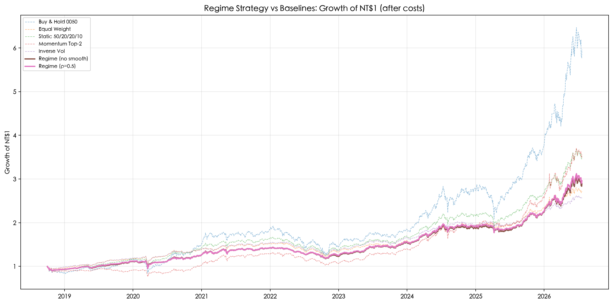
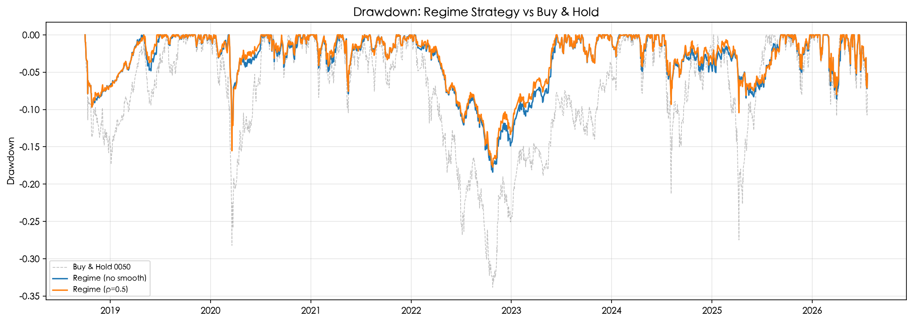
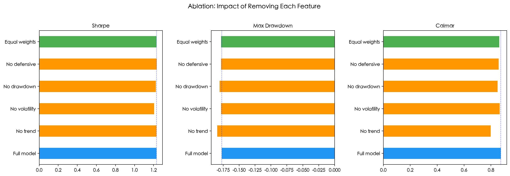
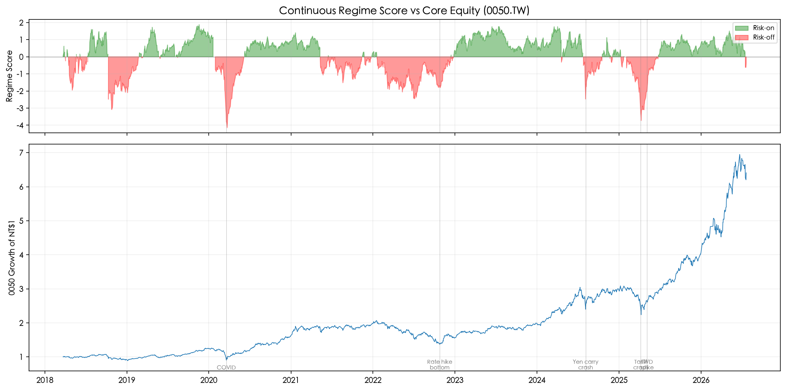

# Regime-Aware Tactical Allocation across Taiwan-Listed ETFs

Uses trend, volatility, drawdown, and cross-asset momentum to build a continuous
market regime score. The score is mapped to equity allocation weights via sigmoid,
with the remainder split across bonds, gold, and cash. Monthly rebalanced, with
transaction costs.

## Result

Sample: 2017-09-19 to 2026-07-21 (2146 trading days). Signal at month-end close,
execution at next trading day's close (old weights earn the execution day's
return; new weights take effect the day after). Base cost: 20 bps per unit of
turnover. Cash proxy: fixed 1.5% annual rate.

| Strategy | Annual Return | Volatility | Sharpe | Sortino | Max Drawdown | Calmar | Turnover |
|---|---:|---:|---:|---:|---:|---:|---:|
| Buy & Hold 0050 | 26.82% | 21.60% | 1.139 | 1.201 | -33.83% | 0.793 | 0.13 |
| Equal Weight | 14.24% | 10.63% | 1.165 | 1.149 | -20.68% | 0.689 | 0.48 |
| Static 50/20/20/10 | 18.23% | 13.34% | 1.210 | 1.219 | -25.53% | 0.714 | 0.45 |
| Momentum Top-2 | 18.43% | 15.46% | 1.075 | 1.028 | -23.55% | 0.782 | 4.17 |
| Inverse Vol | 13.40% | 9.76% | 1.184 | 1.160 | -19.53% | 0.686 | 1.44 |
| Regime (no smoothing) | 15.18% | 11.03% | 1.201 | 1.197 | -18.25% | 0.832 | 2.56 |
| **Regime (rho=0.5)** | **15.54%** | **10.98%** | **1.235** | **1.246** | **-17.61%** | **0.883** | **1.37** |

Regime (rho=0.5) beats every baseline on Sharpe, Sortino, and Calmar, and has
the lowest max drawdown of all seven. This holds across low/base/conservative
cost scenarios (10/20/40 bps) and after excluding either 2020 or 2025 from the
sample. The tradeoff: absolute return is lower than Buy & Hold in every
sub-period tested -- this strategy trades return for drawdown control.

## Ablation

Removing each feature one at a time shows trend is the primary driver of the
drawdown/Calmar improvement; the other three features contribute marginally.
Equal-weight coefficients (0.25 each) perform comparably to the hand-picked
ones (0.35/-0.25/0.20/-0.20), meaning the result isn't sensitive to the exact
coefficient choice.

## Regime score vs price

## Known issues found and fixed

Two accounting bugs in the backtest engine were found via code review and
fixed (see commit history):

1. **Execution timing**: the new position was earning a return on the
   execution day itself, before the trade could actually have occurred at
   that day's close. Fixed so the old weights earn the execution day's
   return, and the new weights only start earning returns the day after.
2. **Turnover double-counting**: cash is the residual of the ETF weights
   (not an independent position), so counting its change separately as
   turnover double-counted every rebalance involving cash. This specifically
   inflated the Regime strategy's measured cost, since it's the only
   strategy with a materially time-varying cash weight.

Fixing these changed the Regime vs Static comparison meaningfully: before the
fix, Regime's Sharpe advantage over Static shrank to a loss under
conservative costs. After the fix, Regime beats Static under all three cost
scenarios tested.

## How to run

    python3 -m venv .venv && source .venv/bin/activate
    pip install -r requirements.txt
    jupyter lab

Run the notebooks in order: 01_data_audit -> 02_baselines -> 03_regime_signal -> 04_robustness.

Data is downloaded from Yahoo Finance on the first run and cached in data/processed/.

## ETF universe

| Ticker | Name | Role | Exchange |
|---|---|---|---|
| 0050.TW | 元大台灣50 | Core equity | TWSE |
| 00713.TW | 元大高息低波 | Defensive equity | TWSE |
| 00679B.TWO | 元大美債20年 | Long-term US Treasury | TPEx |
| 00635U.TW | 元大S&P黃金 | Gold futures | TWSE |

00679B is listed on the Taipei Exchange (TPEx), so it uses .TWO in Yahoo Finance, not .TW.
00679B is an unhedged USD bond ETF; 00635U has ~1.5-2% annual futures roll cost.

## Structure

    src/
      data_loader.py        Download + panel construction
      data_validation.py    Quality checks, dividend verification
      features.py           Regime signal features
      regime_signal.py      Continuous score + weight mapping
      allocation.py         Baseline strategies
      backtest.py           Monthly-rebalanced backtest engine
      metrics.py            Sharpe, Sortino, Calmar, drawdown, etc.

    notebooks/
      01_data_audit          Data download, validation, dividend cross-check
      02_baselines           Five baselines (B&H, equal weight, static, momentum, inv-vol)
      03_regime_signal       Regime strategy backtest vs baselines
      04_robustness          Ablation, sensitivity, cost scenarios, sub-period analysis

    tests/
      test_no_lookahead.py   Verify no future data leaks into features/scores/weights/execution timing/turnover

## Tests

    pytest tests/test_no_lookahead.py -v
